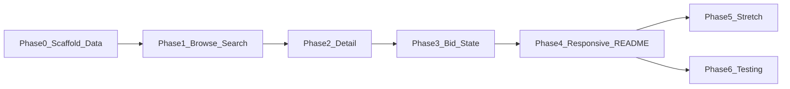

# The Block: step-by-step development plan

This plan is ordered to satisfy the **Minimum Bar** first ([README.md](README.md) lines 42–51), then the fuller **Core Requirements** where they add product detail (lines 21–27), and finally **stretch** and **testing**.

## Checklist (phases)

- [ ] Phase 0 — Project scaffold and data wiring
- [ ] Phase 1 — Inventory browsing and search
- [ ] Phase 2 — Vehicle detail experience
- [ ] Phase 3 — Bidding and visible state
- [ ] Phase 4 — Responsive polish and README
- [ ] Phase 5 — Stretch goals (optional)
- [ ] Phase 6 — Testing suites (optional)

## What “minimum bar” maps to in the product

| README requirement | Concrete deliverable |
|--------------------|----------------------|
| Inventory browsing and search | List/grid of vehicles from JSON with text search (and optional filters if time allows within MVP) |
| Clear vehicle detail experience | Dedicated detail view/route showing specs, condition grade + report, damage notes, title, dealership, location, auction fields, image gallery |
| Bid flow with updated visible state | Form to submit a bid; after submit, UI shows new `current_bid`, incremented `bid_count`, validation (e.g. must exceed current bid / meet minimum increment), and feedback (success/error) |
| Desktop and mobile | Responsive layout, touch-friendly targets, readable typography, navigable gallery on small screens |
| Clone and run via README | Prerequisites, install, dev command, build/preview if applicable, where data lives |

**Assumptions (per README):** frontend-only is fine; no auth; bids can persist in memory or `localStorage` so state survives refresh during the demo—document the choice in README.

---

## Phase 0 — Project scaffold and data wiring

1. **Choose stack** (README suggests React + Vite; Tailwind optional). Initialize app in-repo (e.g. `web/` or repo root—pick one and document it).
2. **Import dataset:** Copy or import [`data/vehicles.json`](data/vehicles.json) into the build (Vite: place under `public/` **or** import as module). Ensure production build still serves the data.
3. **Types:** Define a `Vehicle` type/interface matching the JSON shape (see README example: `id`, `vin`, year/make/model/trim, specs, condition fields, `images`, `selling_dealership`, `lot`, auction fields, `current_bid`, `bid_count`, etc.).
4. **Routing:** Add client-side routes at minimum: `/` (inventory), `/vehicle/:id` (detail). Use React Router or equivalent.

**Exit criteria:** App runs locally; list can log or render count 200 without errors.

---

## Phase 1 — Inventory browsing and search (Minimum Bar #1)

1. **Browse UI:** Card or row layout with primary fields: photo thumbnail, year/make/model, city/province, `current_bid`, maybe `auction_start` or status label.
2. **Search:** Client-side filter on concatenated fields (make, model, trim, VIN, lot, city, dealership) debounced for smooth typing.
3. **Optional within MVP scope:** Simple sort (price, year) and 1–2 filters (make, body style)—only if they do not delay the rest; search alone satisfies the bar.
4. **Empty state:** Message when no matches.

**Exit criteria:** User can find a vehicle by typing; list remains usable on a narrow viewport.

---

## Phase 2 — Vehicle detail experience (Minimum Bar #2 + Core “specs, condition, damage, dealership, photos”)

1. **Layout:** Hero image + thumbnail strip or carousel; sections for **Specs** (engine, transmission, drivetrain, fuel, odometer, colors, body style), **Condition** (grade, report, damage list, title), **Location & seller** (dealership, city, province, lot, VIN).
2. **Auction block:** `starting_bid`, `reserve_price` (display policy: e.g. “reserve not met” vs hidden—pick one and document), `buy_now_price` if present, `auction_start` (formatted; optional relative “time until” per README assumption).
3. **Navigation:** Back to inventory; deep-linkable URL by `id`.

**Exit criteria:** All fields in the README sample are represented clearly; photos are browsable on mobile.

---

## Phase 3 — Bidding and visible state (Minimum Bar #3)

1. **Rules:** Minimum next bid = `current_bid` + increment (e.g. $100) or `starting_bid` if no bids; validate in UI before submit.
2. **State:** On successful bid, update in-memory (and optionally `localStorage` keyed by `id`) so `current_bid` and `bid_count` change everywhere (detail + list if list shows those fields).
3. **UX:** Disabled submit while invalid; inline error text; success confirmation; consider optimistic UI only if errors are impossible (here, all client-side—simple synchronous update is fine).

**Exit criteria:** After placing a bid, the user immediately sees higher bid and count without manual refresh; list and detail stay consistent if both show bid data.

---

## Phase 4 — Responsive polish and README (Minimum Bar #4–5)

1. **Responsive pass:** Breakpoints for grid columns, stack auction vs gallery on small screens, adequate tap targets (e.g. 44px), no horizontal scroll except intentional carousels.
2. **README:** Replace or extend root [README.md](README.md) with **How to Run** (Node version, `npm install`, `npm run dev`, `npm run build` / preview), **assumptions** (bid persistence, reserve display), and pointers to [SUBMISSION.md](SUBMISSION.md)-style sections if you use that template.
3. **Smoke test:** Fresh clone → install → dev server → browse, search, detail, bid.

**Exit criteria:** Matches “repo we can clone and run by following your README.”

---

## Phase 5 — Stretch goals (after minimum bar is solid)

Per README “Stretch Ideas” (lines 52–58): prioritize buyer clarity, trust, and polish—not feature count.

**Product / UX (pick 1–3):**

- Reserve / “buy now” messaging and clearer auction status
- Compare shortlist or saved vehicles (`localStorage`)
- Skeleton loaders, image lazy loading, reduced motion preference
- Countdown normalized to “now” for demo consistency
- Stronger empty/error states and accessibility (focus order, labels, contrast)

**Technical:**

- Extract small presentational components; keep bid/search logic in hooks or thin services
- Light theming or design tokens for consistent spacing and type scale

---

## Phase 6 — Testing suites (optional, after MVP)

Align with [SUBMISSION.md](SUBMISSION.md) “Testing” section for the walkthrough.

**Suggested layers (incremental):**

1. **Unit tests:** Pure functions—search/filter, `nextMinimumBid(vehicle)`, formatting helpers (currency, dates).
2. **Component tests:** Inventory list filtering, bid form validation messages (React Testing Library + Vitest if using Vite).
3. **E2E (time permitting):** Playwright: load inventory → open detail → place bid → assert updated bid on page.

**Exit criteria:** CI or local `npm test` documented in README; a few high-value tests that protect core flows rather than blanket coverage.

---

## Dependency order (mermaid)

---

## Files you will likely add or touch

- New: app source under chosen directory (e.g. `src/`), route components, `Vehicle` types, bid/search utilities, styles.
- Existing: [README.md](README.md) for run instructions; optionally [SUBMISSION.md](SUBMISSION.md) for narrative sections.
- Data: keep [`data/vehicles.json`](data/vehicles.json) as source of truth; wire the app to it as in Phase 0.

No changes required to [`scripts/generate_vehicles.mjs`](scripts/generate_vehicles.mjs) for the minimum bar unless you regenerate data.
